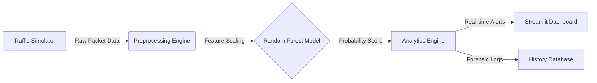

# 🛡️ Sentinel-NIDS: Enterprise AI Threat Detection


> **Real-time Network Intrusion Detection System (NIDS) utilizing Random Forest Classifiers to detect Denial of Service (DoS) and Probe attacks with 98% Recall.**


---

## 📖 Overview
Traditional firewalls rely on static signatures, leaving networks vulnerable to zero-day attacks. **Sentinel-NIDS** leverages Machine Learning to analyze packet behavior (traffic volume, error rates, protocol types) to flag malicious activity instantly.

This project simulates a **Security Operations Center (SOC)** environment, featuring:

- **"God Mode" Simulation:** Instantly generate specific traffic patterns (Safe vs. Attack) to test model resilience.
- **Forensic Analytics:** A granular log system tracking packet size, protocol usage, and threat probability scores.
- **Smart Correlation:** An inference engine correlating SYN error rates with service behavior to detect sophisticated DoS attacks.

---

## 🏗️ System Architecture



---

## 📊 Model Performance

Trained on the **NSL-KDD** dataset (25,000+ records). The model was optimized for **High Recall** to minimize False Negatives — the most dangerous failure in cyber defense.

| Metric      | Score  | Business Impact |
|-------------|--------|-----------------|
| Accuracy    | 98.4%  | Strong overall classification |
| Precision   | 98.1%  | Low false-positive rate |
| Recall      | 98.7%  | **Critical — catches ~99% of attacks** |
| F1-Score    | 98.4%  | Balanced performance |

---

## 🚀 Quick Start

### 1. Clone the Repository

```bash
git clone https://github.com/Milan1806/sentinel-nids-ml.git
cd sentinel-nids-ml
```

### 2. Install Dependencies

```bash
pip install -r Requirement.txt
```

### 3. Initialize Model  
(Optional — skip if using pre-trained model)

```bash
python src/training/train_model.py
```

### 4. Launch Dashboard

```bash
streamlit run ui/app.py
```

---

## 🕹️ User Guide

The **Sentinel Control Panel** in the dashboard lets you test all IDS modes:

### 😇 1. Normal Traffic  
Simulates legitimate user behavior.  
**Expected:** Low risk score (<10%), “SAFE” status.

### 😈 2. Attack Traffic  
Simulates a **Neptune DoS (SYN Flood)** pattern.  
**Expected:** High risk score (>90%), “CRITICAL” alert.

### 🧪 3. Manual Traffic Testing  
Adjust parameters such as:
- SYN error rate  
- Packet throughput  
- Connection resets  
- Protocol anomalies  

Ideal for edge-case testing and demonstrating ML interpretability.

---

## 🛠️ Tech Stack

- **Language:** Python 3.10  
- **Machine Learning:** Scikit-learn (Random Forest)  
- **Data Processing:** Pandas, NumPy  
- **Visualization:** Streamlit, Altair  
- **Architecture:** Modular Python packages (`src.common`, `src.training`)  

---

## 📂 Project Structure

```text
sentinel-nids-ml/
├── assets/                  # Images and Screenshots
├── data/                    # Raw NSL-KDD datasets
├── models/                  # Serialized .pkl models & encoders
├── src/
│   ├── common/              # Shared preprocessing logic
│   └── training/            # Model training pipeline
├── ui/                      # Streamlit Dashboard source code
└── Requirement.txt         # Project dependencies
```

---

## 🤝 Contributing

Contributions are welcome!  
Please open an issue or submit a pull request for improvements.

---

## 👤 Author

**Milan Malakiya**  
- LinkedIn: https://www.linkedin.com/in/milanmalakiya  
- GitHub: https://github.com/Milan1806  

**License:** MIT
