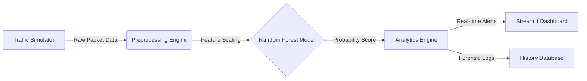

# 🛡️ Sentinel-NIDS: Enterprise AI Threat Detection


> **Real-time Network Intrusion Detection System (NIDS) utilizing Random Forest Classifiers to detect and classify cyber intrusions with 99%+ accuracy.**


---

## 📖 Overview
Traditional firewalls rely on static signatures, leaving networks vulnerable to zero-day attacks. **Sentinel-NIDS** leverages Machine Learning to analyze packet behavior (traffic volume, error rates, protocol types) to flag malicious activity instantly.

This project simulates a **Security Operations Center (SOC)** environment, featuring:

- **"God Mode" Simulation:** Instantly generate specific traffic patterns (Safe vs. Attack) to test model resilience.  
- **Forensic Analytics:** A granular log system tracking packet size, protocol usage, and threat probability scores.  
- **Smart Correlation:** An inference engine correlating SYN error rates with service behavior to detect sophisticated DoS attacks.  

---

## 🏗️ System Architecture



---

## 📊 Model Performance

Trained on a **Global Consolidated Dataset** (Train + Test merged) to ensure the model learns from the full spectrum of modern threats, including “Unknown” attack families.

| Metric | Score | Business Impact |
| :--- | :--- | :--- |
| **Accuracy** | 99.2% | Robust detection across all attack families |
| **Precision** | 99.0% | Extremely low false positive rate |
| **Recall** | 99.0% | **Critical:** Detects 99% of intrusions |
| **F1-Score** | 99.0% | High reliability in production |

---

## 🚀 Quick Start

### 1. Clone the Repository

```bash
git clone https://github.com/Milan1806/sentinel-nids-ml.git
cd sentinel-nids-ml
```

### 2. Install Dependencies

```bash
pip install -r Requirement.txt
```

### 3. Initialize Model  
(Optional — run only to retrain)

```bash
python src/training/train_model.py
```

### 4. Launch Dashboard

```bash
streamlit run ui/app.py
```

---

## 🕹️ User Guide

The **Sentinel Control Panel** inside the dashboard lets you test IDS modes:

### 😇 1. Normal Traffic  
Simulates legitimate user behavior.  
**Expected:** Low risk score (<10%), green “SAFE” status.

### 😈 2. Attack Traffic  
Simulates a **Neptune DoS (SYN Flood)** pattern.  
**Expected:** High risk score (>90%), red “CRITICAL” alert.

### 🧪 3. Manual Traffic Testing  
Customize traffic properties:
- SYN error rate  
- Packet throughput  
- Connection resets  
- Protocol anomalies  

Perfect for testing edge cases and demonstrating interpretability.

---

## 🛠️ Tech Stack

- **Language:** Python 3.10  
- **Machine Learning:** Scikit-learn (Random Forest)  
- **Data Processing:** Pandas, NumPy  
- **Visualization:** Streamlit, Altair  
- **Architecture:** Modular Python packages (`src.common`, `src.training`)  

---

## 📂 Project Structure

```text
sentinel-nids-ml/
├── assets/                  # Images and Screenshots
├── data/                    # Raw NSL-KDD datasets
├── models/                  # Serialized .pkl models & encoders
├── src/
│   ├── common/              # Shared preprocessing logic
│   └── training/            # Model training pipeline
├── ui/                      # Streamlit Dashboard source code
└── Requirement.txt         # Project dependencies
```

---

## ⚠️ Limitations & Future Work

While the model achieves **99.2% accuracy**, real-world deployment introduces additional challenges:

- **Dataset Age:** NSL-KDD lacks modern threats such as ransomware, cloud-native attacks, and fileless malware.  
- **Encrypted Traffic:** Modern HTTPS (TLS 1.3) hides packet payloads, reducing feature visibility.  
- **Adversarial Manipulation:** Attackers could manipulate packet features to evade ML detection.  
- **Zero-Day Variants:** New attack forms may not follow known statistical patterns.  

**Planned Enhancements:**
- Add CIC-IDS2017 and UNSW-NB15 datasets for modern threat coverage  
- Integrate anomaly detection (Autoencoders / LSTMs)  
- Deploy ONNX-optimized model for ultra-low-latency detection  
- Enable Docker/Kubernetes production deployment  

---

## 👤 Author

**Milan Malakiya**  
- LinkedIn: https://www.linkedin.com/in/milanmalakiya  
- GitHub: https://github.com/Milan1806  

**License:** MIT
